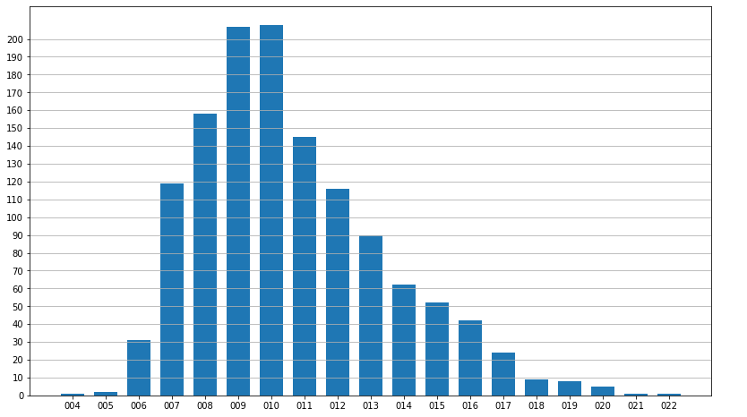
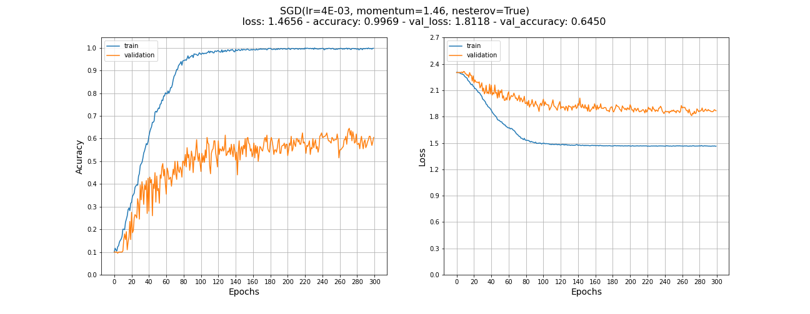
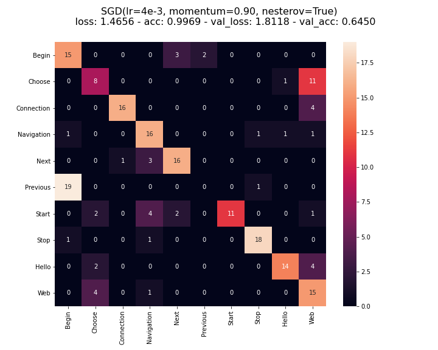

## SpeechRecognition
This repository contains code and experiments for lip reading problems.

#### Model
We use a model inspired by a paper 'LipNet: End-to-End Sentence-level Lipreading' by Yannis M. Assael, Brendan Shillingford, Shimon Whiteson, and Nando de Freitas (https://arxiv.org/abs/1611.01599).

#### Dataset
The model uses MIRACL dataset (https://sites.google.com/site/achrafbenhamadou/-datasets/miracl-vc1). \
The model was trained to predict words only. \
Length of videos varies from 4 to 22 frames.

To tackle this issue we padded each sequence to reach 22 frames.

#### Results

#####Accuracy

| Word      | Accuracy |
|:------------|:----------|
| Begin      | 0.75     |
| Choose     | 0.40     |
| Connection | 0.80     |
| Navigation | 0.80     |
| Next       | 0.80     |
| Previous   | 0.00     |
| Start      | 0.55     |
| Stop       | 0.90     |
| Hello      | 0.70     |
| Web        | 0.75     |
| Total      | 0.65     |

##### Accuracy plot

##### Confusion matrix

To ensure that our results are reproducible and represenvative we shuffled training data and set seeds for operations involving random.

Dependencies are listed in ``lip_reading/requirements.txt``